<!--
  Profile README for V Rohith Pranov.
  Every tile in ./assets is a self-contained animated SVG generated by tools/gen.py
  (design language: Apple web design system; one accent, #0066cc).
  Edit copy or motion in tools/gen.py, then run:  python3 tools/gen.py
-->

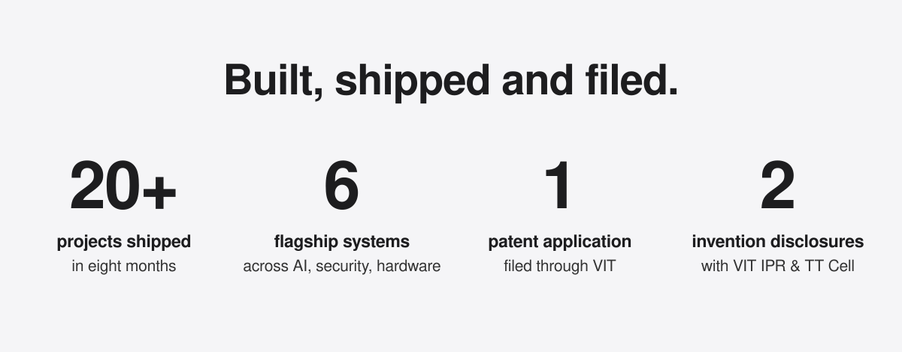

<a href="https://github.com/Rohithpranov07/HotelOS"></a>

<b>HotelOS tech specs</b>

 

Built for and shipped to **Hotel Kodai International**. Guest conversations arrive over WhatsApp, land in a CRM with memory, and an AI orchestrator turns them into work across independent services — bookings, housekeeping, staff workflows and payments — all visible on one live operations screen.

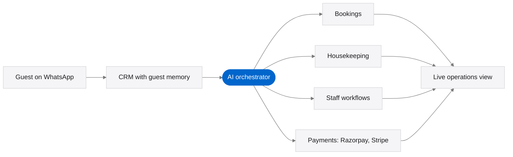

**Stack** — Claude and OpenAI APIs, Pinecone, WhatsApp Business, Razorpay, Stripe, AWS, microservices.

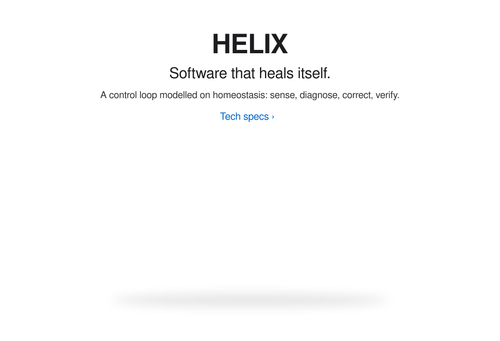
<!-- When the HELIX repo is public, wrap the image above in <a href="…"> -->

<b>HELIX tech specs</b>

 

Production systems drift out of health quietly; monitoring tells you something broke but rarely puts it back. HELIX treats software health the way a body treats temperature — sense against healthy set-points, detect deviation, diagnose, respond, and verify the return to equilibrium. Monitoring becomes a regulatory loop instead of an alarm.

Taken from internship prototype to formal IP: **VIT Invention Disclosure Forms A and B** prepared with the IPR & Technology Transfer Cell, then pressure-tested against an adversarial examiner review to sharpen the claims.

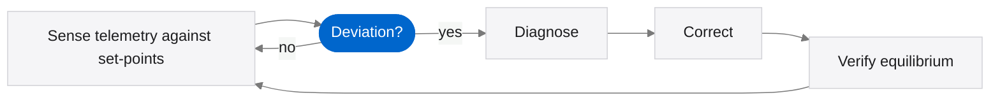

<a href="https://github.com/Ajay-1011-git/KAAVAL"></a>

<b>KAAVAL tech specs</b>

 

Adversary-in-the-middle phishing kits steal the session cookie *after* MFA succeeds and replay it from anywhere. **PulseLock** binds every authenticated request to a non-exportable, per-session browser key, so a replayed cookie without that key is refused at the gateway.

**My part:** I own **GatewayCore**, the enforcement point that verifies the session–key binding on every request, alongside my teammates' RadarGuardian, BrowserSDK and DashboardChronicle modules.

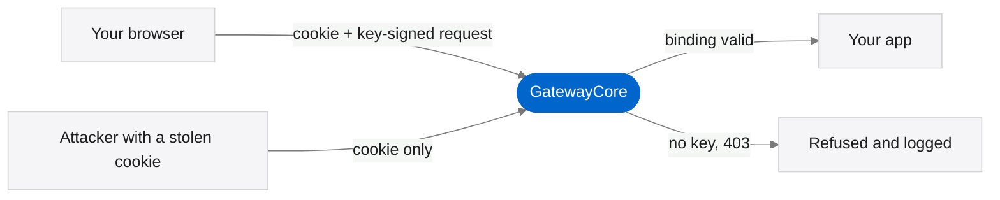

<!-- When the flood project repo is public, wrap the image above in <a href="…"> -->

<b>Flood AI tech specs</b>

 

Regional forecasts can see a storm three days out but are blind at street level, which is exactly where people and property get hurt. A 72-hour regional forecast (GEFS, with fallback models) hands off to a **neural physics engine** — a MeshGraphNets surrogate trained on a photogrammetry-scanned real site and calibrated by live ESP32 water-level sensors. Its output feeds a hazard × exposure × vulnerability ranking and a Three.js alert view with multi-lingual warnings. A hand-written shallow-water finite-volume solver stands by as the fallback engine.

Next: a waterlogging early-warning pilot for the VIT Vellore campus.

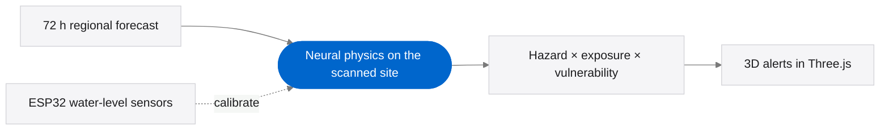

<a href="https://github.com/Rohithpranov07/RiderShield_HelmetAI"></a>

<b>RiderShield AI tech specs</b>

 

An edge-intelligent helmet and two-wheeler telemetry stack. IMU and ultrasonic sensing detect potholes and standing water and map them onto a **DIGIPIN** grid; grip asymmetry and tremor drift feed an LSTM that pauses task allocation when a rider is fatigued; YOLOv8-nano handles vision on device; and eFuse hardware-rooted attestation makes hazard reports trustworthy enough for automated claims.

Filed as a **patent application** through VIT's IPR & TT Cell — one of six inventors. [Live demo](https://rider-shield-plan.vercel.app)

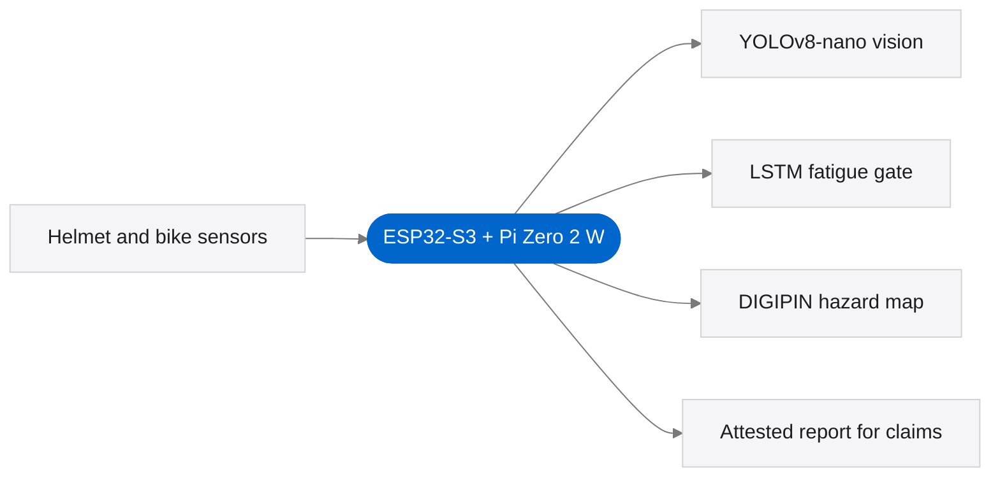

<a href="https://github.com/Rohithpranov07/ProofStack"></a>

<b>ProofStack tech specs</b>

 

Screening by hand is slow and inconsistent: two reviewers can read the same resume and reach different verdicts. ProofStack parses each resume into structured data, scores every candidate on the same rubric — skills, experience and projects — and returns a ranked shortlist with a breakdown behind every score. Python and FastAPI.

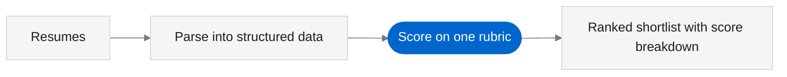

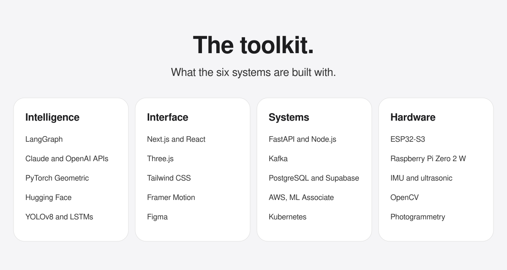
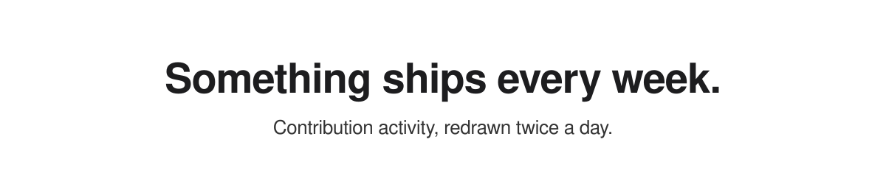

<picture>
  <source media="(prefers-color-scheme: dark)" srcset="https://raw.githubusercontent.com/Rohithpranov07/Rohithpranov07/output/snake-dark.svg" />
  <source media="(prefers-color-scheme: light)" srcset="https://raw.githubusercontent.com/Rohithpranov07/Rohithpranov07/output/snake-light.svg" />
  
</picture>

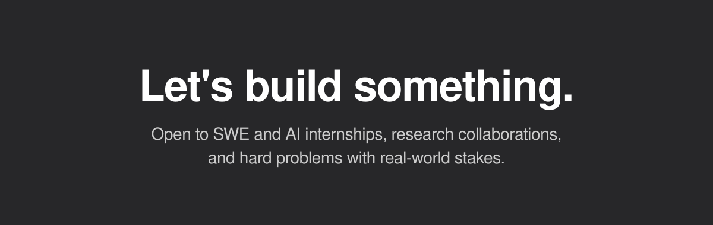<a href="mailto:rohithpranovv@gmail.com">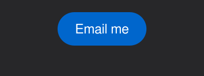</a><a href="https://linkedin.com/in/rohith-pranov">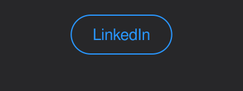</a><a href="https://rohithpranov.online">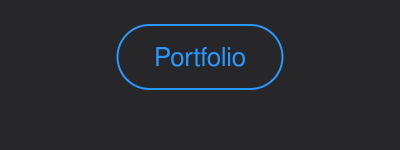</a>
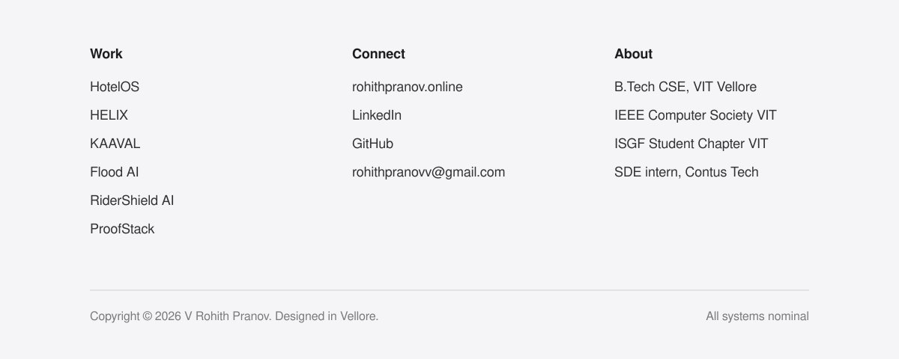
